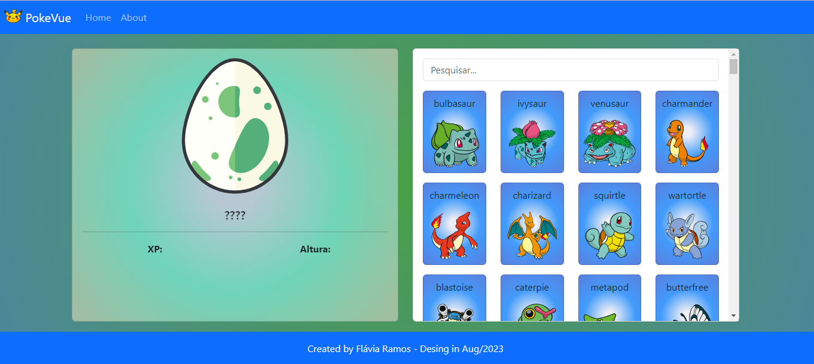
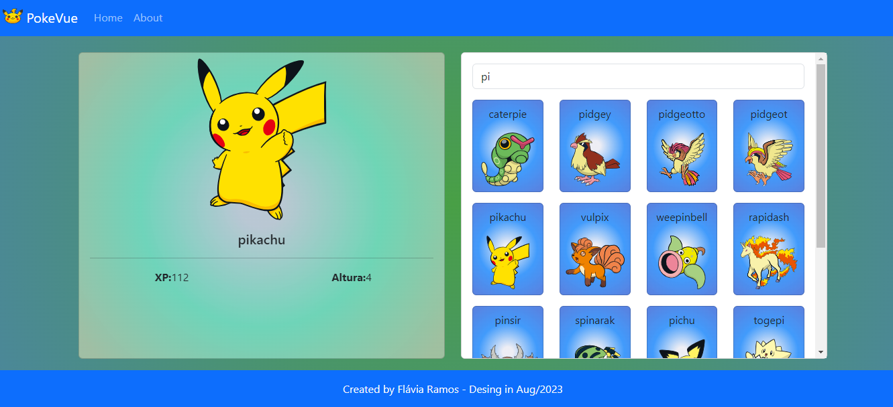
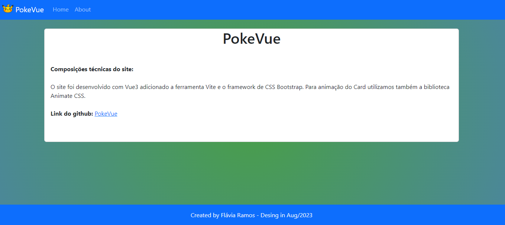

## :file_folder: PokeVue

Este projeto foi um desafio que recebi em um processo seletivo em que fui aprovada para fase seguinte.
Recebi o desafio de realizá-lo no framework Vue, o qual eu não conhecia. Portanto meu desafio era não só realizar o site, como aprender o Vue antes e durante a execução da Pokedex. Me senti muito orgulhosa de ter conseguido realizar o objetivo no tempo estipulado e ter sido aprovada para as próximas fases. Infelizmente em etapas posteriores o pessoal seguiu com outro candidato, mas ficou a experiência e a demonstração do meu poder de aprendizado. 
 
O site foi desenvolvido com Vue3 adicionado a ferramenta Vite e o framework de CSS Bootstrap. Para animação do Card utilizei também a biblioteca Animate CSS.

## :computer: Tecnologias utilizadas:

- HTML
- CSS com Bootstrap
- JS
- Vue com Vite

## :rocket: Visite o site (projeto publicado):
:fast_forward:<a href="https://pokevue-flavia-ramos.netlify.app/"> Pokevue</a>

## :flower_playing_cards: Imagens do Projeto:

<video controls>
<source src="./src/assets/Animacao_card.mp4">
</video>
